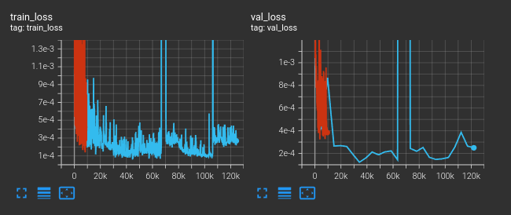

# The Dataset

The un-augmented dataset can be downloaded here. It contains several hundred trajectories of state/action information.

https://drive.google.com/file/d/1FgE1qNDeKJzN_fraKHjUmkFSzetHnRLS/view?usp=sharing

So that it has the folder structure:

```
cylinders_simple_demo
 |- data
    |- gz and pkl files...
    |- test/val/train split text files
```

The data set consists of pkl files, which contain some meta-data as well as filenames of the rest of the data (the .pkl.gz files).
The pkl and pkl.gz files each contain a single dictionary, which in turn contains the data. Most of the data is float32 numpy arrays.
Each example is a single trajectory of length 50.

# Running the example

1. Generate the augmented dataset


    ./scripts/generate_augmented_dataset.py -h  # help info
    ./scripts/generate_augmented_dataset.py ./data aug_hparams/cylinders.hjson ./data_aug


2. train the dynamics model


    ./scripts/train-test_dynamics.py train -h  # see training options
    ./scripts/train-test_dynamics.py train ./data_aug hparams/propnet.hjson

3. evaluate the dynamics model


    ./scripts/train-test_dynamics.py eval -h  # see eval options
    ./scripts/train-test_dynamics.py train ./data tb_logs/version_XXX # full unique model name from the above training run

# Making a comparison to no augmentation

In this case, you can just train the dynamics model on the original dataset, instead of the augmented one.
You can then compare the two using the same validation set (use the un-augmented one for this).


# Example Results

## Augmentations
Here are some visualizations of the first few augmented examples. On my computer (1080ti), I can generate ~3 augmentations per second.

## Training Curves



## Evaluation Metrics

Testing

| Method | mean position error |
|---|---|
| Without Augmentation | 0.00617 |
| With Augmentation    | 0.00168 |

## Misc

In the simple cylinders example, I re-wrote everything to use pytorch only instead of tensorflow.
If you'd like to use tensorflow, you can see the main implementation.

